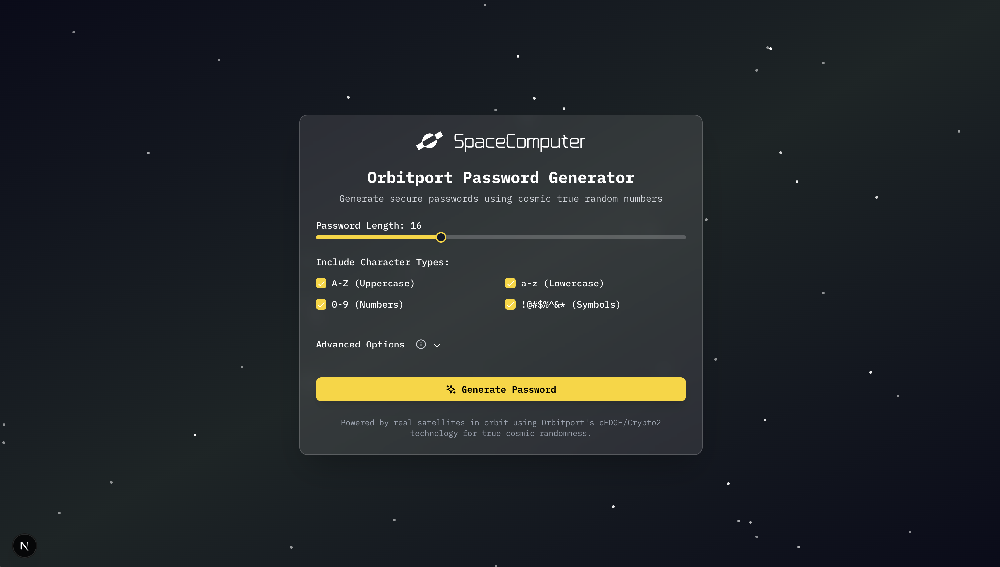

# SIWE with Cosmic Nonce

A space-themed Sign-In with Ethereum (SIWE) demo that leverages Orbitport's cTRNG (cosmic True Random Number Generator) API to generate secure nonces for authentication. Experience the future of Web3 authentication with true cosmic randomness.



## 🌌 Features

- **Cosmic Nonce Generation**: Uses Orbitport's cTRNG API for true random nonces from space
- **Interactive Stepper UI**: Visual step-by-step process with loading states and progress indicators
- **SIWE Implementation**: Complete Sign-In with Ethereum flow with signature verification
- **Fallback Support**: Automatic fallback to local crypto if cosmic service is unavailable
- **Mismatch Simulation**: Test error handling with simulated nonce mismatches

## 🚀 Getting Started

### Prerequisites

- Node.js 20+
- npm, yarn, or pnpm
- Orbitport API credentials (for true cosmic randomness)

### Installation

1. Clone the repository:

```bash
git clone https://github.com/spacecomputerio/cosmic-siwe.git
cd cosmic-siwe
```

2. Install dependencies:

```bash
npm install
# or
yarn install
```

3. Create a `.env.local` file in the root directory:

```env
ORBITPORT_API_URL=https://dev-1usujmbby8627ni8.us.auth0.com
ORBITPORT_AUTH_URL=https://op.spacecomputer.io
ORBITPORT_CLIENT_ID=your-client-id
ORBITPORT_CLIENT_SECRET=your-client-secret
AUTH_SECRET=your-32-byte-secret
```

> **Note:** The app works without Orbitport credentials using local crypto fallback, but for true cosmic randomness, get your credentials from [Orbitport](https://docs.spacecomputer.io).

4. Start the development server:

```bash
npm run dev
# or
yarn dev
```

The application will be available at `http://localhost:3000`.

## 🔐 Technical Implementation

### Cosmic Nonce Generation

The app uses Orbitport's cTRNG API to generate true random nonces from space-based sources:

1. **Randomness Source:**

   - Primary: Orbitport cTRNG API (satellite-based randomness)
   - Fallback: Node.js `crypto.randomBytes()` (local randomness)

2. **SIWE Flow:**
   - User connects wallet
   - Backend requests cosmic nonce from Orbitport's API
   - User signs SIWE message with the nonce
   - Backend verifies signature and nonce match
   - Session is established upon successful verification

### API Integration

The app uses Next.js API routes to securely communicate with Orbitport's API:

```typescript
// Example nonce generation with cosmic randomness
export async function GET() {
  try {
    // Get OAuth token from Orbitport
    const authResponse = await fetch(`${ORBITPORT_AUTH_URL}`, {
      method: "POST",
      headers: { "Content-Type": "application/json" },
      body: JSON.stringify({
        client_id: ORBITPORT_CLIENT_ID,
        client_secret: ORBITPORT_CLIENT_SECRET,
        audience: `${ORBITPORT_API_URL}/api`,
        grant_type: "client_credentials",
      }),
    });
    const data = await authResponse.json();
    const token = data.access_token;

    // Get cosmic random bytes
    const response = await fetch(`${ORBITPORT_API_URL}/api/v1/services/trng`, {
      headers: { Authorization: `Bearer ${token}` },
    });
    const randomData = await response.json();

    // Convert to nonce
    const nonce = generateNonce(randomData.bytes);
    return { nonce };
  } catch (error) {
    // Fallback to local crypto
    const nonce = generateNonce();
    return { nonce, fallback: true };
  }
}
```

### Stepper UI Process

The application features a visual stepper that guides users through the SIWE process:

1. **Connect Wallet**: Shows wallet connection status
2. **Generate Nonce**: Backend generates cosmic nonce with loading animation
3. **Sign Message**: User signs SIWE message with wallet
4. **Verify Signature**: Backend verifies signature and nonce match

Each step includes:

- **Progress indicators** with color-coded states
- **Loading animations** with spinning icons
- **Error handling** with visual feedback
- **Success celebration** with completion screen

## 🛠️ Tech Stack

- [Next.js](https://nextjs.org/) - React framework
- [TypeScript](https://www.typescriptlang.org/) - Type safety
- [Tailwind CSS](https://tailwindcss.com/) - Styling
- [shadcn/ui](https://ui.shadcn.com/) - UI components
- [Lucide React](https://lucide.dev/) - Icons
- [Wagmi](https://wagmi.sh/) - Ethereum hooks
- [ConnectKit](https://docs.family.co/connectkit) - Wallet connection
- [SIWE](https://docs.login.xyz/) - Sign-In with Ethereum
- [Orbitport API](https://docs.spacecomputer.io) - Cosmic randomness

## 📱 Usage

1. **Connect Wallet**: Click the ConnectKit button to connect your Ethereum wallet
2. **Choose Flow**:
   - "Sign-In with Ethereum" for normal flow
   - "Simulate Mismatch" to test error handling
3. **Follow Steps**: Watch the stepper guide you through the process
4. **Verify**: Complete the signature verification
5. **Restart**: Try different flows or start a new session

## 🔧 Development

### Project Structure

```
src/
├── app/
│   ├── api/
│   │   ├── nonce/     # Cosmic nonce generation
│   │   ├── random/    # Random number endpoint
│   │   └── verify/    # SIWE signature verification
│   ├── layout.tsx
│   └── page.tsx       # Main UI with stepper
├── components/
│   ├── ui/            # shadcn/ui components
│   └── starfield.tsx  # Cosmic background
├── hooks/
│   └── useSIWE.ts     # SIWE logic hook
├── lib/
│   ├── auth.ts        # Authentication utilities
│   ├── session.ts     # Session management
│   └── utils.ts       # Utility functions
└── types/
    └── orbitport.ts   # TypeScript definitions
```

### Key Components

- **`useSIWE` Hook**: Manages the entire SIWE flow with cosmic nonce generation
- **Stepper UI**: Visual process flow with loading states
- **Session Management**: Iron-session based session handling
- **Error Handling**: Graceful fallbacks and user feedback

## 📝 License

This project is licensed under the MIT License.

## 🙏 Acknowledgments

- [Orbitport](https://docs.spacecomputer.io) for cosmic true random number generation
- [SIWE](https://docs.login.xyz/) for the Sign-In with Ethereum standard
- [ConnectKit](https://docs.family.co/connectkit) for wallet connection
- All contributors to the open-source libraries used in this project
