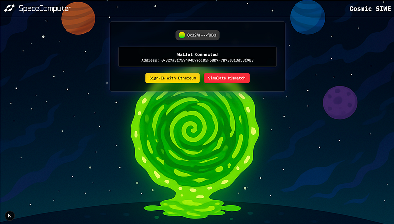

# Orbitport Password Generator

A cosmic-themed password generator that leverages Orbitport's cTRNG (cosmic True Random Number Generator) API to create high-entropy, secure passwords. Generate passwords with customizable requirements, all powered by true randomness from satellites in orbit.



## 🌌 Features

- Space-inspired, glassmorphic UI with glowing cosmic effects
- Secure password generation using Orbitport's cTRNG API
- Customizable password parameters:
  - Length (8-32 characters)
  - Minimum uppercase, lowercase, numbers, symbols
- One-click copy to clipboard
- View the random seed used for transparency
- Automatic fallback to local crypto if API is unavailable
- Responsive and accessible design (WCAG compliant)

## 🚀 Getting Started

### Prerequisites

- Node.js 20+
- npm, yarn, or pnpm
- Orbitport API credentials (for true cosmic randomness)

### Installation

1. Clone the repository:

```bash
git clone https://github.com/spacecomputerio/cosmic-cipher.git
cd password-generator
```

2. Install dependencies:

```bash
npm install
# or
yarn install
```

3. Create a `.env.local` file in the root directory (optional for cTRNG):

```env
ORBITPORT_API_URL=https://dev-1usujmbby8627ni8.us.auth0.com
ORBITPORT_AUTH_URL=https://op.spacecomputer.io
ORBITPORT_CLIENT_ID=your-client-id
ORBITPORT_CLIENT_SECRET=your-client-secret
AUTH_SECRET= # 32 bytes long secret
NEXT_PUBLIC_BASE_PATH=/cipher
```

> **Note:** The app works without Orbitport credentials using local crypto, but for true cosmic randomness, get your credentials from [Orbitport](https://docs.spacecomputer.io).

4. Start the development server:

```bash
npm run dev
# or
yarn dev
```

The application will be available at `http://localhost:3000`.

## 🔐 Technical Implementation

### Cosmic Randomness Integration

The app uses Orbitport's cTRNG API to generate true random numbers from space-based sources:

1. **Randomness Source:**

   - Primary: Orbitport cTRNG API (satellite-based randomness)
   - Fallback: Node.js `crypto.randomBytes()` (local randomness)

2. **Password Generation Flow:**
   - User configures password requirements
   - App requests a random seed from Orbitport's API
   - Password is generated using the seed, meeting all minimum requirements
   - The random seed is displayed for transparency
   - If the API is unavailable, local crypto is used as a fallback

### API Integration

The app uses a Next.js API route to securely communicate with Orbitport's API:

```typescript
// Example API route implementation
export async function GET() {
  // Get OAuth token from Orbitport
  const authResponse = await fetch(`${ORBITPORT_AUTH_URL}`, {
    method: "POST",
    headers: { "Content-Type": "application/json" },
    body: JSON.stringify({
      client_id: ORBITPORT_CLIENT_ID,
      client_secret: ORBITPORT_CLIENT_SECRET,
      audience: `${ORBITPORT_API_URL}/api`,
      grant_type: "client_credentials",
    }),
  });
  const data = await authResponse.json();
  const token = data.access_token;

  const response = await fetch(`${ORBITPORT_API_URL}/api/v1/services/trng`, {
    headers: { Authorization: `Bearer ${token}` },
  });
  return response.json();
}
```

## 🛠️ Tech Stack

- [Next.js](https://nextjs.org/)
- [TypeScript](https://www.typescriptlang.org/)
- [Tailwind CSS](https://tailwindcss.com/)
- [shadcn/ui](https://ui.shadcn.com/)
- [Lucide React](https://lucide.dev/)
- [Orbitport API](https://docs.spacecomputer.io)

## 📱 Usage

1. Set your desired password length and minimum requirements
2. Click "Generate Password"
3. Copy your password or view the random seed for transparency

## 📝 License

This project is licensed under the MIT License.

## 🙏 Acknowledgments

- [Orbitport](https://docs.spacecomputer.io) for cosmic true random number generation
- All contributors to the open-source libraries used in this project
